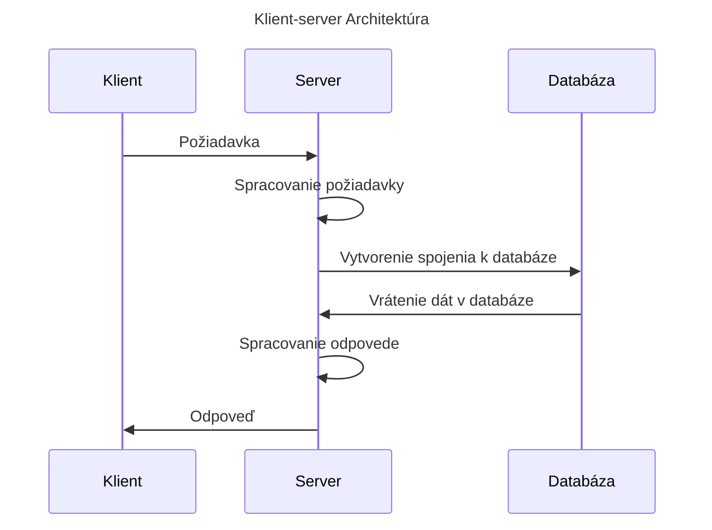

# Projekt pre predmet 2. semestra UKF FPVaI (Skriptovacie Jazyky)

Nasledujúci súbor obsahuje informácie o mojom semestrálnom projekte pre predmet "Skriptovacie jazyky" na Fakulte Prírodných Vied a Informatiky Univerzity Konštantína Filozofa v Nitre.

## Životný cyklus vývoja projektu

Použil som šablónu ktorú som mal pre projekt v predmete "Jazyky webu", kde sme vytvárali statickú stránku. Úlohou je túto šablónu prispôsobiť pre dynamickú stránku.

Projekt bol vyvíjaný v prostredí [Visual Studio Code](https://code.visualstudio.com/) a [XAMPP](https://www.apachefriends.org/index.html).

## 1. Čo je cieľom?

Princíp PHP spočíva v tom, že klient odošle na náš server požiadavku. Jednotlivé požiadavky sa spracujú v PHP skriptoch, ktoré sú uložené na serveri. Tieto skripty sa spustia pri každej požiadavke a vygenerujú odpoveď, ktorá sa odošle klientovi. V tom spočíva princíp dynamickosti stránky - každá jedinečná požiadavka vygeneruje inú odpoveď pri rôznych vstupných parametroch.



Ale predtým, než budeme môcť vytvárať akúkoľvek zmysluplnú stránku s logickými vlastnosťami a prvkami dynamickosti, musíme najskôr pripraviť naše šablóny.

## 2. Úprava šablóny

Všetok dynamický kód sa dá previesť na PHP kód. Ale nie vždy je to možné aj naopak (z dynamického obsahu nevieme jednoznačne určiť konkrétny statický obsah, pretože máme veľa možností ako by statický obsah mohol vyzerať).

V našom prípade sa jedná o konverziu statického kódu na dynamický. Zoberme si nasledujúci príklad jednoduchého HTML kódu:

```html
<!DOCTYPE html>
<html lang="en">
<head>
    <meta charset="UTF-8">
    <meta http-equiv="X-UA-Compatible" content="IE=edge">
    <meta name="viewport" content="width=device-width, initial-scale=1.0">
    <title>Document</title>
</head>
<body>
    <p>Ahoj!</p>
</body>
</html>
```

Už iba jednoduché pridanie `<?php`, `?>` značiek a vloženie kódu do nich nám umožní vytvoriť obsah ktorý sa považuje za "dynamický":

```php
<!DOCTYPE html>
<html lang="en">
<head>
    <meta charset="UTF-8">
    <meta http-equiv="X-UA-Compatible" content="IE=edge">
    <meta name="viewport" content="width=device-width, initial-scale=1.0">
    <title>Document</title>
</head>
<body>
    <p><?php echo "Ahoj!"; ?></p>
</body>
</html>
```

Prečo je obsah dynamický, aj keď sa vždy vypíše iba `"Ahoj!"`? Pretože v PHP môžeme využiť rôzne funkcie, podmienky, cykly a mnoho ďalších vecí, ktoré nám umožnia vytvoriť obsah, ktorý sa bude meniť v závislosti od rôznych faktorov. Na miesto `"Ahoj!"` môžeme vložiť prakticky čokoľvek, čo nám umožní jazyk PHP.

Naším cieľom bude teraz zjednodušiť všetky šablóny a odstrániť duplicitu kódu. Môžeme si napríklad všimnúť, že všetok náš statický HTML kód obsahuje rovnakú (alebo veľmi podobnú hlavičku). Prečo by sme mali mať túto hlavičku v každom súbore, keď ju môžeme mať iba v jednom súbore a vložiť ju do všetkých ostatných súborov pomocou PHP?

### Základné PHP koncepty

Aké sú teda niektoré základné funkcie, ktoré by nám pomohli zjednodušiť šablóny a odstrániť duplicitu kódu?

- `include` - Táto funkcia nám umožňuje vložiť obsah z iného súboru do aktuálneho súboru. Týmto spôsobom môžeme vytvoriť jednu hlavičku a vložiť ju do všetkých našich súborov.
- `require` - Táto funkcia funguje rovnako ako `include`, ale s jedným rozdielom: ak sa súbor nepodarí načítať, skript sa zastaví a vyhodí chybu. `include` len vypíše chybu priamo na stránke (v mieste, kde by sa mal súbor vložiť), ale skript pokračuje ďalej a stránka sa vykreslí celá.
- `include_once` a `require_once` - Tieto funkcie fungujú rovnako ako `include` a `require`, ale s jedným rozdielom: súbor sa načíta iba raz. Ak sa pokúsime viackrát načítať súbor, ktorý sme už predtým načítali, PHP toto volanie odignoruje a nič sa nestane.
- `echo` - Táto funkcia nám umožňuje vypísať text na stránku. Môžeme v nej využiť rôzne premenné, konštanty, alebo dokonca iné funkcie.
- `print` - Táto funkcia funguje rovnako ako `echo`, ale s jedným rozdielom: `print` vracia hodnotu `1`, zatiaľ čo `echo` nevracia žiadnu hodnotu.

#### Kedy je vhodné použiť `include` a kedy `require`?

Väčšina ľudí používa `include` a `require` ako synonymá, ale to nie je úplne správne. `include` a `require` sa líšia v tom, ako sa správajú, keď sa pokúsia načítať súbor, ktorý neexistuje. `include` len vypíše chybu a pokračuje ďalej, zatiaľ čo `require` zastaví skript a vyhodí chybu. Preto je dôležité zvážiť, ktorú funkciu použiť v závislosti od toho, čo chceme dosiahnuť.

Napríklad, v prípade ak by sme načítavali konfiguračný súbor ktorý obsahuje údaje potrebné pre nadviazanie spojenia k databáze, je lepšie použiť `require`, pretože ak sa tento súbor nepodarí načítať, nemá zmysel pokračovať ďalej, pretože nemáme dostatočné informácie na to, aby sme mohli pokračovať.

Na druhej strane, ak by sme načítavali súbor, ktorý obsahuje nejaké nepovinné informácie (napríklad nejaké štatistiky návštevnosti ktoré sa zobrazia na stránke, ak sú k dispozícii), je lepšie použiť `include`, pretože ak sa tento súbor nepodarí načítať, nemá význam zastaviť celý skript a vyhodiť chybu, pretože stránka môže fungovať aj bez týchto informácií.

Podobne musíme rozlišovať aj `include_once` a `require_once`. Ak načítavame súbor, ktorý obsahuje nejaké dôležité funkcie, je lepšie použiť `require_once`, pretože ak by sme tento súbor načítali viackrát, mohlo by to spôsobiť problémy (napríklad redefiníciu funkcií, čo by spôsobilo nekonzistentnosť stránky alebo závažnejšie chyby). Taktiež, ak načítavame napríklad hlavičku stránky, je lepšie použiť `include_once`, pretože ak by sme túto hlavičku načítali viackrát, mohlo by to spôsobiť problémy s CSS štýlmi alebo inými vecami, ktoré by sa mohli zobrazovať viackrát na stránke (ale hlavičku potrebujeme predsa zobraziť iba raz).

### Vloženie prvku dynamickosti do existujúcich súborov v šablóne

Poďme teda na príklad. Predpokladajme, že máme nasledujúci súbor `header.php`:

```php
<!DOCTYPE html>
<html lang="en">
<head>
    <meta charset="UTF-8">
    <meta http-equiv="X-UA-Compatible" content="IE=edge">
    <meta name="viewport" content="width=device-width, initial-scale=1.0">
    <title>Document</title>
</head>
<body>
    <header>
        <h1>Moja stránka</h1>
    </header>
```

A predpokladajme, že máme nasledujúci súbor `footer.php`:

```php
    <footer>
        <p>&copy; 2024 Moja stránka</p>
    </footer>
</body>
</html>
```

Máme taktiež k dispozícii `index.php`:

```php
<?php include 'header.php'; ?>
    <main>
        <p>Vitajte na mojej stránke!</p>
    </main>
<?php include 'footer.php'; ?>
```

Ak si otvoríme `index.php` v prehliadači, uvidíme nasledujúci výstup:

```html
<!DOCTYPE html>
<html lang="en">
<head>
    <meta charset="UTF-8">
    <meta http-equiv="X-UA-Compatible" content="IE=edge">
    <meta name="viewport" content="width=device-width, initial-scale=1.0">
    <title>Document</title>
</head>
<body>
    <header>
        <h1>Moja stránka</h1>
    </header>
    <main>
        <p>Vitajte na mojej stránke!</p>
    </main>
    <footer>
        <p>&copy; 2024 Moja stránka</p>
    </footer>
</body>
</html>
```

Ako vidíme, všetky súbory boli úspešne načítané a výsledná stránka vyzerá tak, ako sme očakávali. Týmto spôsobom môžeme vytvoriť jednoduchú šablónu, ktorú môžeme ľahko upravovať a prispôsobovať našim potrebám. Napríklad, ak chceme zmeniť niečo v hlavičke alebo päte, nemusíme to robiť v každom súbore zvlášť, ale stačí nám zmenu vykonať iba v jednom súbore (`header.php` alebo `footer.php`) a zmeny sa prejavia vo všetkých ostatných súboroch automaticky.

### Čo vlastne znamená `index.php`?

`index.php` je špeciálny názov súboru, ktorý sa používa na označenie domovskej stránky.

Štandardný postup pri drtivej väčšine webových serverov je nasledovný:

- Keď zadáte adresu webovej stránky do prehliadača, server sa pokúsi nájsť súbor s názvom `index.php` v koreňovom adresári webovej stránky a odoslať jeho obsah klientovi.
- Ak sa súbor `index.php` nenájde, server sa pokúsi nájsť súbor s názvom `index.html` alebo `index.htm`. Ak ani jeden z týchto súborov nenájde, tak server prehliadaču zobrazí zoznam súborov v adresári alebo vyhodí chybu 404 (stránka nenájdená).

Názov `index` je všeobecná konvencia ktorá sa používa pre webové servery. Ak zmeníme nastavenie webového servera a špecifikujeme iný názov súboru ktorý sa má použiť pre domovskú stránku, môžeme si vybrať prakticky ľubovoľný názov súboru, ktorý chceme (ak to operačný systém dovoľuje, resp. názov súboru neobsahuje nepovolené znaky - samozrejme, duh...) - ale je dobré dodržiavať konvencie, aby sme sa vyhli zbytočným problémom.

### Commit pre úpravu šablón

Nasledujúci commit obsahuje zmeny ktoré som vykonal pre úpravu šablóny: [bb1055fb425ecd32e2d0c704a0b0481a8cdb5975](https://github.com/SKevo18/sj_projekt/commit/bb1055fb425ecd32e2d0c704a0b0481a8cdb5975)

Následne som ešte vykonal rôzne kozmetické úpravy pre vylepšenú organizáciu kódu (napríklad presun všetkých štýlov, skriptov a médii do samostatného súboru `assets`, vytvorenie `_inc` súboru, formátovanie kódu) - commit [918c22f40a2b65a916c73565ed7c0f0ae89239c7](https://github.com/SKevo18/sj_projekt/commit/918c22f40a2b65a916c73565ed7c0f0ae89239c7).

#### Poznámka: čo je súbor `.gitignore`?

Súbor `.gitignore` je súbor, ktorý obsahuje zoznam súborov a adresárov, ktoré chceme ignorovať pri verzionovaní pomocou Gitu. Tento súbor je veľmi užitočný, pretože nám umožňuje vynechať súbory, ktoré by sme nemali zdielať verejne (napríklad súbory s citlivými údajmi, súbory s dočasnými dátami, súbory s logmi, atď.).

Neskôr vysvetlím použitie `config.php` v súvislosti s konfiguračným súborom pre pripojenie k databáze (respektíve: v produkcii by sme asi nechceli verejne zdielať naše citlivé údaje pre vytvorenie pripojenia k databáze).

## 3. Syntax PHP

Medzičasom by sme mohli vykonať ešte rôzne iné kozmetické úpravy - napríklad vytvorenie asociatívneho poľa pre uchovanie odkazov na rôzne stránky. Následne vytvoríme funkciu ktorá akceptuje toto poľe ako argument a vykreslí pre nás navigačnú lištu so všetkými odkazmi. Týmto spôsobom môžeme jednoducho pridávať alebo odoberať odkazy z navigačnej lišty bez toho, aby sme museli upravovať kód v každom súbore zvlášť, alebo písať zdlĺhavý HTML kód.

### Čo je asociatívne pole?

Asociatívne pole je špeciálny typ poľa, ktoré obsahuje kľúče a hodnoty. Kľúče môžu byť ľubovoľné reťazce alebo čísla, zatiaľ čo hodnoty môžu byť ľubovoľné dátové typy (napríklad reťazce, čísla, boolean hodnoty, alebo dokonca iné poľia). Je to štruktúra, ktorá je veľmi podobná objektu v iných programovacích jazykoch (napr.: `dict` v Pythone, `Map` v Jave, `Object` v JavaScripte, atď...).

Príklad asociatívneho poľa pre uchovanie odkazov na rôzne stránky:

```php
$pages = [
    'Domov' => 'index.php',
    'O nás' => 'about.php',
    'Kontakt' => 'contact.php',
    'Blog' => 'blog.php',
    'Galeria' => 'gallery.php'
];
```

Príklad funkcie `render_navbar`, ktorá akceptuje toto pole ako argument a vykreslí pre nás navigačnú lištu, by mohol vyzerať nasledovne:

```php
function render_navbar(array $pages) {
    echo '<nav>';
    echo '<ul>';
    foreach ($pages as $title => $url) {
        echo '<li><a href="' . $url . '">' . $title . '</a></li>';
    }
    echo '</ul>';
    echo '</nav>';
}
```

Ak teraz zavoláme túto funkciu s naším asociatívnym poľom `$pages` ako argument, vykreslí sa nám navigačná lišta so všetkými odkazmi:

```php
render_navbar($pages);
// Výstup:
// <nav>
//     <ul>
//         <li><a href="index.php">Domov</a></li>
//         <li><a href="about.php">O nás</a></li>
//         <li><a href="contact.php">Kontakt</a></li>
//         <li><a href="blog.php">Blog</a></li>
//         <li><a href="gallery.php">Galeria</a></li>
//     </ul>
// </nav>
// poznámka: výstup je odsadený pre lepšiu čitateľnosť, ale v skutočnosti sa všetky elementy vypíšu
// v jednom riadku bez tabulátorov (odsadenia) - pre webový prehliadač to nie je dôležité, pretože
// to pokladá za správny HTML kód
```

Syntax PHP obsahuje základné koncepty, ktoré nájdeme v iných programovacích jazykoch. Nasledujúce odkazy sú užitočné pre začiatočníkov, ktorí sa chcú naučiť základy PHP:

- Priscilla (`Dashboard` > `Course list` > `Jazyky webu` > `PHP` > `PHP - základy jazyka`)
- [W3Schools PHP Tutorial](https://www.w3schools.com/php/)
- [PHP.net Dokumentácia](https://www.php.net/manual/en/index.php)

### Commit pre využitie syntaxe PHP

[115145c8a93652b6d1ca7aa1c7f941ef91745216](https://github.com/SKevo18/sj_projekt/commit/115145c8a93652b6d1ca7aa1c7f941ef91745216)

## 4. Databáza

...
